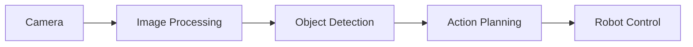

# Diagram-Generator Subagent

**Specialized agent for generating Mermaid diagrams for robotics and AI concepts.**

## Goal
Automatically generate Mermaid diagrams that visualize robotics concepts, architectures, and workflows for textbook content.

## Diagram Types

### 1. ROS 2 Architecture
- Node communication patterns
- Publisher-subscriber flows
- Service-request diagrams
- TF tree structures

### 2. RAG Chatbot Pipeline
- Query flow diagrams
- Retrieval architecture
- Generation pipeline
- System architecture

### 3. Robot Perception System
- Sensor data flow
- Perception pipeline
- Sensor fusion architecture
- Vision processing flow

### 4. Vision-Language-Action (VLA) Workflow
- Model architecture
- Input-output flow
- Training pipeline
- Inference workflow

## Output Format
- Mermaid.js syntax
- Docusaurus-compatible markdown code blocks
- Clear, readable diagrams
- Proper labeling and styling

## Usage
```bash
# Invoke the subagent
skill: "diagram-generator"
```

## Example Output


