# Robotics & AI Diagrams Collection

Auto-generated Mermaid diagrams for textbook content. These diagrams can be embedded directly in Docusaurus markdown files.

---

## ROS 2 Architecture Diagrams

### ROS 2 Publisher-Subscriber Pattern

Shows how multiple nodes can publish and subscribe to topics in ROS 2.

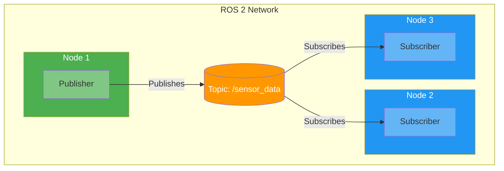

### ROS 2 Service-Client Pattern

Shows synchronous request-response communication in ROS 2.

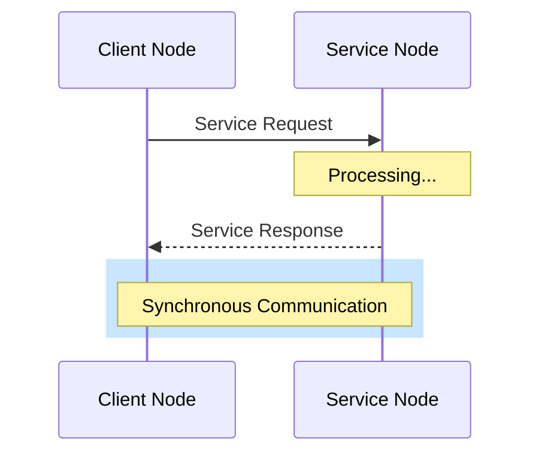

---

## RAG Chatbot Diagrams

### RAG Pipeline Architecture

Complete flow from user query to generated answer with sources.

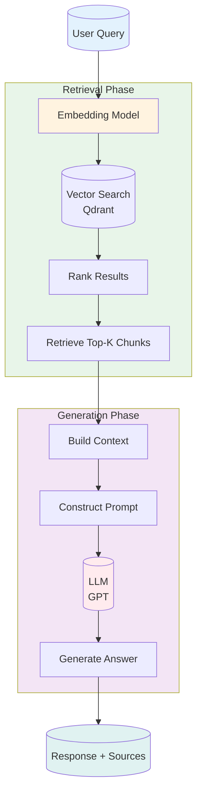

### RAG System Architecture

High-level architecture showing all components and their relationships.

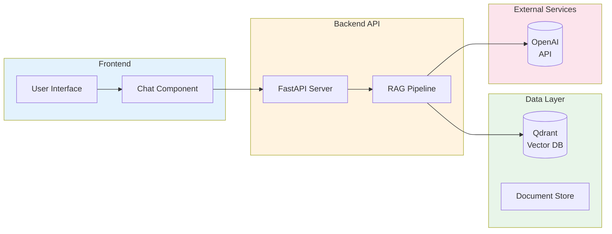

---

## Robot Perception Diagrams

### Robot Perception Pipeline

Complete perception pipeline from raw sensor data to world model.

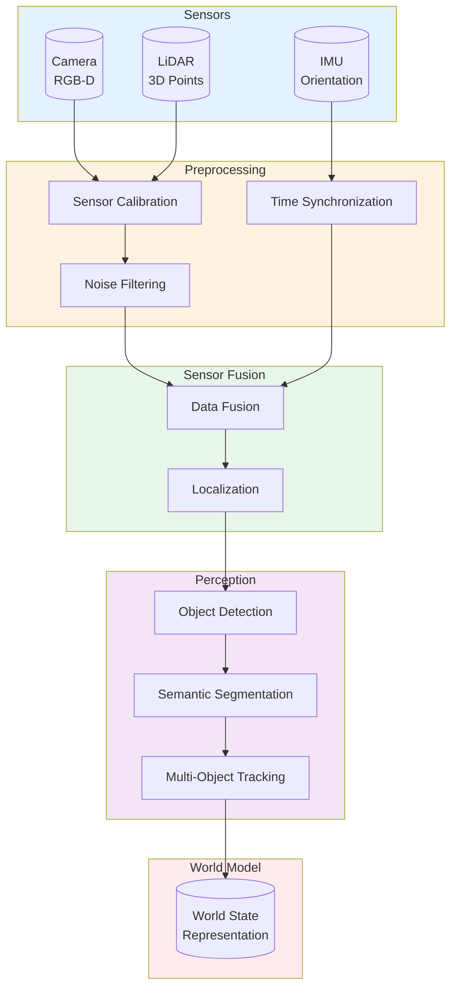

### Robot Control Loop

Classic sense-plan-act control loop for robotics.

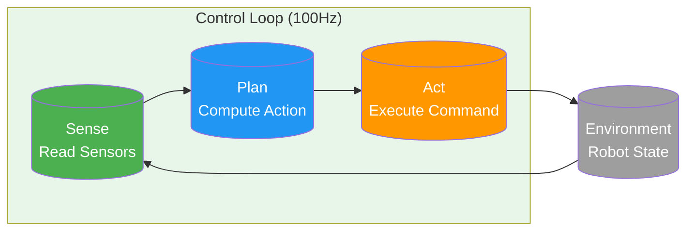

---

## Vision-Language-Action (VLA) Diagrams

### VLA Model Architecture

VLA model that takes vision, language, and proprioception to output robot actions.

```mermaid
graph LR
    subgraph Inputs["Input Encoders"]
        Vision[("Vision<br/>ViT Encoder")]
        Language[("Language<br/>LLM Encoder")]
        Proprio[("Proprioception<br/>Joint States")]
    end
    
    subgraph Fusion["Multimodal Fusion"]
        CrossAttn[Cross-Attention<br/>Layers]
        Fusion[Fusion<br/>Transformer]
    end
    
    subgraph Output["Action Output"]
        ActionHead[("Action<br/>Head")]
        Traj[Trajectory<br/>Points]
    end
    
    Vision --> CrossAttn
    Language --> CrossAttn
    Proprio --> Fusion
    CrossAttn --> Fusion
    Fusion --> ActionHead
    ActionHead --> Traj
    
    style Inputs fill:#E3F2FD
    style Fusion fill:#FFF3E0
    style Output fill:#E8F5E9
    style Vision fill:#4CAF50,color:#fff
    style Language fill:#2196F3,color:#fff
    style ActionHead fill:#FF9800,color:#fff
```

### VLA Training and Inference Workflow

End-to-end workflow from data collection to robot execution.

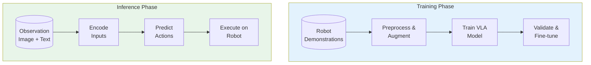

---

## Navigation & SLAM Diagrams

### SLAM Pipeline

Simultaneous Localization and Mapping pipeline.

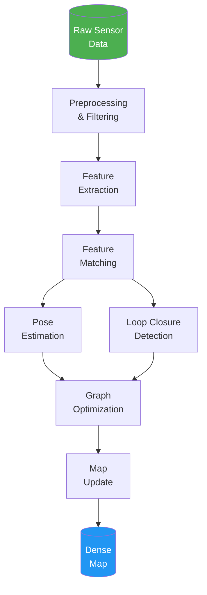

### Robot Navigation Stack

Navigation2 stack showing global and local planning.

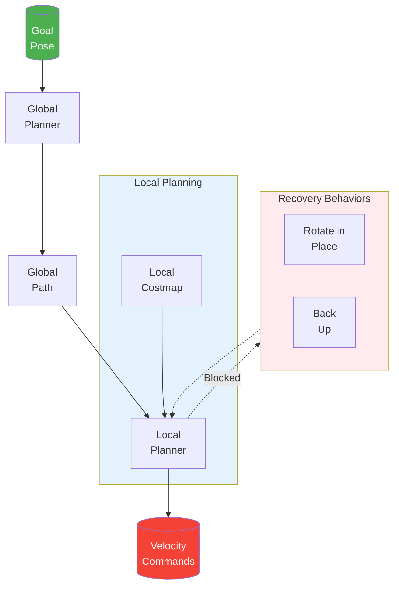

### Multi-Sensor Fusion Architecture

Shows how multiple sensors are calibrated and fused.

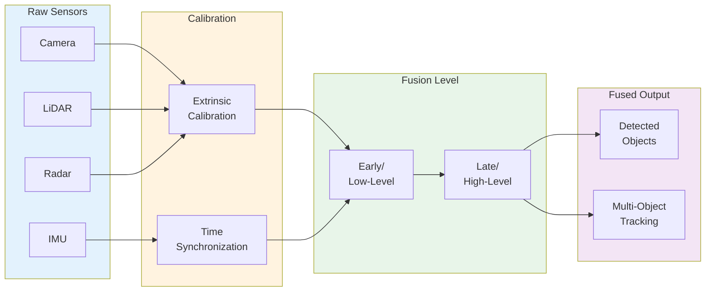

---

## Usage in Docusaurus

To use these diagrams in your Docusaurus documentation:

1. Copy the Mermaid code block
2. Paste it into your markdown file
3. Docusaurus will automatically render the diagram

```markdown
### Diagram Title

Description text here.

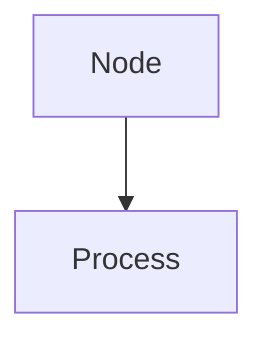
```

## Customizing Diagrams

You can customize diagrams by:
- Changing colors in the `style` definitions
- Adding more nodes and edges
- Modifying the direction (TD, LR, BT, RL)
- Adding subgraphs for grouping
