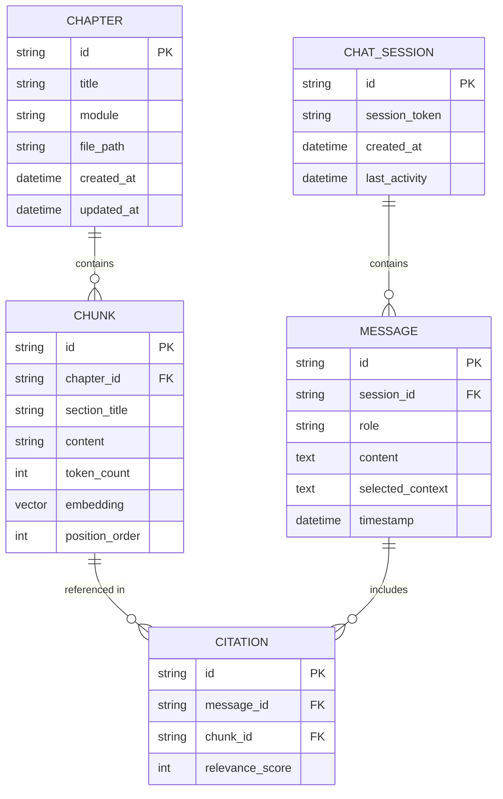

# Data Model: RAG Chatbot

**Feature**: 001-rag-chatbot  
**Date**: 2026-03-14  
**Purpose**: Define data entities, relationships, and validation rules

---

## Entity Relationship Diagram



---

## Entities

### Chapter

Represents a textbook chapter (Markdown file) that has been ingested into the knowledge base.

**Fields**:
| Field | Type | Constraints | Description |
|-------|------|-------------|-------------|
| id | string | PK, unique | Slugified chapter identifier (e.g., `module1-ros2-basics`) |
| title | string | NOT NULL | Chapter title from frontmatter |
| module | string | NOT NULL | Parent module (e.g., `Module 1`, `Module 2`) |
| file_path | string | NOT NULL, unique | Relative path in docs/ directory |
| created_at | datetime | NOT NULL | Ingestion timestamp |
| updated_at | datetime | NOT NULL | Last re-ingestion timestamp |

**Validation Rules**:
- `id` must be URL-safe (lowercase, hyphens only)
- `file_path` must start with `docs/` and end with `.md`
- `module` must match one of: Module 1, Module 2, Module 3, Module 4, Capstone

**State Transitions**:
```
Created → Indexed → (Updated → Indexed)* → Archived
```

---

### Chunk

A segment of a chapter converted into an embedding for semantic search.

**Fields**:
| Field | Type | Constraints | Description |
|-------|------|-------------|-------------|
| id | string | PK, unique | Unique chunk identifier |
| chapter_id | string | FK → Chapter.id | Parent chapter reference |
| section_title | string | NOT NULL | Section/subsection heading |
| content | text | NOT NULL | Chunk text content (500-1000 tokens) |
| token_count | integer | CHECK (100-1500) | Number of tokens in chunk |
| embedding | vector | DIMENSION 384 | Sentence-transformers embedding |
| position_order | integer | NOT NULL | Order within chapter |

**Validation Rules**:
- `content` must not be empty
- `token_count` must match actual tokenized length (±10% tolerance)
- `embedding` must be 384-dimensional float array
- `position_order` must be unique per chapter

**Relationships**:
- Belongs to one Chapter
- Referenced by zero or more Citations

---

### ChatSession

Represents a conversation session between a user and the chatbot.

**Fields**:
| Field | Type | Constraints | Description |
|-------|------|-------------|-------------|
| id | string | PK, unique | UUID v4 |
| session_token | string | NOT NULL, unique | Client-side session identifier |
| created_at | datetime | NOT NULL | Session start time |
| last_activity | datetime | NOT NULL | Last message timestamp |

**Validation Rules**:
- Sessions expire after 24 hours of inactivity (cleanup job)
- `session_token` can be anonymous (client-generated UUID)

**State Transitions**:
```
Created → Active → (Active)* → Expired
```

---

### Message

A single message in a chat conversation (user query or assistant response).

**Fields**:
| Field | Type | Constraints | Description |
|-------|------|-------------|-------------|
| id | string | PK, unique | UUID v4 |
| session_id | string | FK → ChatSession.id | Parent session reference |
| role | string | ENUM('user', 'assistant', 'system') | Message author type |
| content | text | NOT NULL | Message content |
| selected_context | text | NULL | Highlighted text from user (optional) |
| timestamp | datetime | NOT NULL | Message creation time |

**Validation Rules**:
- `role` must be one of: user, assistant, system
- `content` must not be empty for user/assistant messages
- `selected_context` only present for user messages with text selection

**Relationships**:
- Belongs to one ChatSession
- Associated with zero or more Citations (assistant messages only)

---

### Citation

A reference to a chunk used in generating an assistant response.

**Fields**:
| Field | Type | Constraints | Description |
|-------|------|-------------|-------------|
| id | string | PK, unique | UUID v4 |
| message_id | string | FK → Message.id | Parent assistant message |
| chunk_id | string | FK → Chunk.id | Referenced chunk |
| relevance_score | float | RANGE [0.0, 1.0] | Similarity score from retrieval |

**Validation Rules**:
- `relevance_score` must be between 0 and 1
- Each chunk can only be cited once per message (deduplication)
- Citations only exist for assistant messages

**Relationships**:
- Belongs to one Message
- References one Chunk

---

## Data Flow

### Ingestion Flow

```
docs/*.md files
    ↓
Chapter Parser
    ↓
Chunk Generator (500-1000 tokens, 50 overlap)
    ↓
Embedding Model (all-MiniLM-L6-v2)
    ↓
Qdrant (embeddings) + Neon (metadata)
```

### Query Flow

```
User Query
    ↓
Embedding Model
    ↓
Qdrant Similarity Search (top-k=5)
    ↓
LLM (OpenAI Agents SDK)
    ↓
Response + Citations
    ↓
Store in Neon (Message + Citation records)
```

---

## Indexes

### Qdrant Indexes
- **Primary**: HNSW index on embedding vector (cosine distance)
- **Payload**: chapter_id, module for filtering

### Neon PostgreSQL Indexes
- `chapter(file_path)` - unique lookup
- `chunk(chapter_id)` - foreign key join
- `message(session_id)` - conversation retrieval
- `citation(message_id)` - citation lookup
- `citation(chunk_id)` - reverse reference

---

## Migration Strategy

### Initial Schema Creation
```sql
-- Chapters table
CREATE TABLE chapters (
    id TEXT PRIMARY KEY,
    title TEXT NOT NULL,
    module TEXT NOT NULL,
    file_path TEXT NOT NULL UNIQUE,
    created_at TIMESTAMPTZ NOT NULL DEFAULT NOW(),
    updated_at TIMESTAMPTZ NOT NULL DEFAULT NOW()
);

-- Chunks metadata table (embeddings in Qdrant)
CREATE TABLE chunks (
    id TEXT PRIMARY KEY,
    chapter_id TEXT REFERENCES chapters(id),
    section_title TEXT NOT NULL,
    content TEXT NOT NULL,
    token_count INTEGER CHECK (token_count BETWEEN 100 AND 1500),
    position_order INTEGER NOT NULL
);

-- Chat sessions
CREATE TABLE chat_sessions (
    id UUID PRIMARY KEY DEFAULT gen_random_uuid(),
    session_token TEXT NOT NULL UNIQUE,
    created_at TIMESTAMPTZ NOT NULL DEFAULT NOW(),
    last_activity TIMESTAMPTZ NOT NULL DEFAULT NOW()
);

-- Messages
CREATE TABLE messages (
    id UUID PRIMARY KEY DEFAULT gen_random_uuid(),
    session_id UUID REFERENCES chat_sessions(id),
    role TEXT NOT NULL CHECK (role IN ('user', 'assistant', 'system')),
    content TEXT NOT NULL,
    selected_context TEXT,
    timestamp TIMESTAMPTZ NOT NULL DEFAULT NOW()
);

-- Citations
CREATE TABLE citations (
    id UUID PRIMARY KEY DEFAULT gen_random_uuid(),
    message_id UUID REFERENCES messages(id),
    chunk_id TEXT REFERENCES chunks(id),
    relevance_score FLOAT CHECK (relevance_score BETWEEN 0 AND 1),
    UNIQUE(message_id, chunk_id)
);
```

### Data Seeding
- Run `python scripts/ingest.py --full` after deployment
- Ingests all `docs/` Markdown files
- Creates Chapter and Chunk records
- Upserts embeddings to Qdrant

---

## Data Retention

| Entity | Retention Policy | Cleanup Method |
|--------|------------------|----------------|
| Chapter | Indefinite (until content update) | Manual re-ingestion |
| Chunk | Indefinite (until content update) | Manual re-ingestion |
| ChatSession | 24 hours after last_activity | Cron job (daily) |
| Message | 24 hours (with session) | Cascade delete |
| Citation | 24 hours (with message) | Cascade delete |

**Rationale**: Chat history is ephemeral to reduce storage costs. Content (chapters/chunks) persists until textbook updates.
