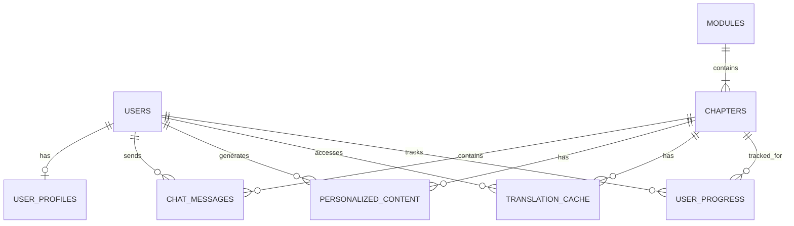
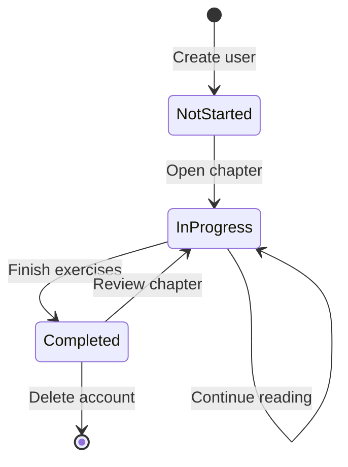
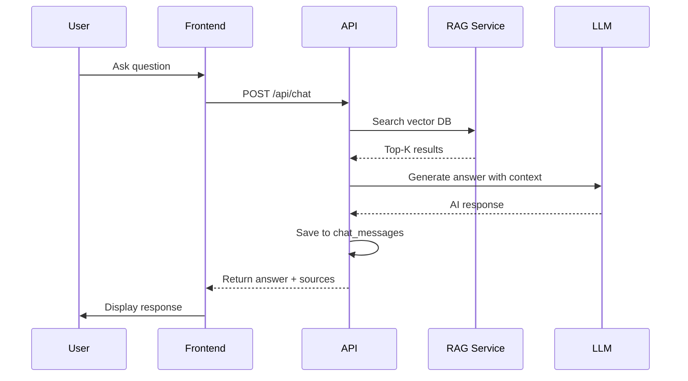

# Data Model Specification

**Date**: 2026-03-11 | **Status**: Complete

## Entity Relationship Diagram



## Core Entities

### 1. Users (BetterAuth Managed)

**Description**: Authentication users managed by BetterAuth

```sql
-- Managed by BetterAuth, referenced by our tables
CREATE TABLE users (
  id UUID PRIMARY KEY DEFAULT gen_random_uuid(),
  email VARCHAR(255) UNIQUE NOT NULL,
  name VARCHAR(255),
  email_verified BOOLEAN DEFAULT FALSE,
  created_at TIMESTAMP DEFAULT CURRENT_TIMESTAMP,
  updated_at TIMESTAMP DEFAULT CURRENT_TIMESTAMP
);
```

**Fields**:
- `id`: UUID, primary key, referenced by all user-related tables
- `email`: Unique user email, used for authentication
- `name`: User's display name
- `email_verified`: Email verification status
- `created_at`: Account creation timestamp
- `updated_at`: Last update timestamp

**Indexes**:
- `idx_users_email`: B-tree on email for fast lookup
- `idx_users_created`: B-tree on created_at for analytics

---

### 2. User Profiles

**Description**: Learning profile with preferences and hardware availability

```sql
CREATE TABLE user_profiles (
  id UUID PRIMARY KEY DEFAULT gen_random_uuid(),
  user_id UUID REFERENCES users(id) ON DELETE CASCADE,
  programming_level VARCHAR(20) NOT NULL CHECK (programming_level IN ('beginner', 'intermediate', 'advanced')),
  ai_knowledge VARCHAR(20) NOT NULL CHECK (ai_knowledge IN ('none', 'basic', 'intermediate', 'advanced')),
  hardware_availability JSONB NOT NULL DEFAULT '{}',
  learning_pace VARCHAR(20) DEFAULT 'normal' CHECK (learning_pace IN ('slow', 'normal', 'fast')),
  preferred_explanation_style VARCHAR(20) DEFAULT 'both' CHECK (preferred_explanation_style IN ('conceptual', 'practical', 'both')),
  created_at TIMESTAMP DEFAULT CURRENT_TIMESTAMP,
  updated_at TIMESTAMP DEFAULT CURRENT_TIMESTAMP,
  UNIQUE(user_id)
);
```

**Fields**:
- `id`: UUID, primary key
- `user_id`: Foreign key to users table (one-to-one relationship)
- `programming_level`: User's programming experience level
- `ai_knowledge`: User's AI/ML knowledge level
- `hardware_availability`: JSONB object with hardware access details
- `learning_pace`: Preferred learning speed
- `preferred_explanation_style`: Conceptual vs practical preference
- `created_at`: Profile creation timestamp
- `updated_at`: Last profile update timestamp

**Hardware Availability Schema**:
```json
{
  "hasRobot": false,
  "hasROS2": false,
  "hasGPU": false,
  "simulationOnly": true
}
```

**Indexes**:
- `idx_user_profiles_user_id`: B-tree on user_id for fast joins
- `idx_user_profiles_programming`: B-tree on programming_level for analytics
- `idx_user_profiles_ai_knowledge`: B-tree on ai_knowledge for personalization

---

### 3. Modules

**Description**: Course modules (4 modules + capstone)

```sql
CREATE TABLE modules (
  id UUID PRIMARY KEY DEFAULT gen_random_uuid(),
  module_number INTEGER NOT NULL UNIQUE,
  title VARCHAR(255) NOT NULL,
  description TEXT,
  order_index INTEGER NOT NULL,
  is_published BOOLEAN DEFAULT FALSE,
  created_at TIMESTAMP DEFAULT CURRENT_TIMESTAMP,
  updated_at TIMESTAMP DEFAULT CURRENT_TIMESTAMP
);
```

**Fields**:
- `id`: UUID, primary key
- `module_number`: Module number (1-4, 99 for capstone)
- `title`: Module title
- `description`: Module description
- `order_index`: Display order in sidebar
- `is_published`: Publication status
- `created_at`: Creation timestamp
- `updated_at`: Last update timestamp

**Sample Data**:
```sql
INSERT INTO modules (module_number, title, description, order_index) VALUES
(1, 'ROS 2 Robotic Nervous System', 'Learn ROS 2 fundamentals', 1),
(2, 'Digital Twin Simulation', 'Simulation with Gazebo and Unity', 2),
(3, 'AI Robot Brain', 'NVIDIA Isaac Sim and AI', 3),
(4, 'Vision Language Action', 'LLM + Robotics Integration', 4),
(99, 'Capstone: Autonomous Humanoid', 'Final project', 5);
```

---

### 4. Chapters

**Description**: Individual chapters within modules

```sql
CREATE TABLE chapters (
  id UUID PRIMARY KEY DEFAULT gen_random_uuid(),
  module_id UUID REFERENCES modules(id) ON DELETE CASCADE,
  chapter_number INTEGER NOT NULL,
  title VARCHAR(255) NOT NULL,
  slug VARCHAR(255) NOT NULL,
  file_path VARCHAR(500) NOT NULL,
  content_hash VARCHAR(64),
  word_count INTEGER,
  is_published BOOLEAN DEFAULT FALSE,
  published_at TIMESTAMP,
  created_at TIMESTAMP DEFAULT CURRENT_TIMESTAMP,
  updated_at TIMESTAMP DEFAULT CURRENT_TIMESTAMP,
  UNIQUE(module_id, chapter_number),
  UNIQUE(slug)
);
```

**Fields**:
- `id`: UUID, primary key
- `module_id`: Foreign key to modules table
- `chapter_number`: Chapter number within module
- `title`: Chapter title
- `slug`: URL-friendly identifier
- `file_path`: Path to markdown file in docs/
- `content_hash`: SHA-256 hash for cache invalidation
- `word_count`: Chapter word count
- `is_published`: Publication status
- `published_at`: Publication timestamp
- `created_at`: Creation timestamp
- `updated_at`: Last update timestamp

**Indexes**:
- `idx_chapters_module_id`: B-tree on module_id for module chapters lookup
- `idx_chapters_slug`: B-tree on slug for URL routing
- `idx_chapters_published`: Partial index on is_published = true

---

### 5. Chat Messages

**Description**: Chatbot conversation history

```sql
CREATE TABLE chat_messages (
  id UUID PRIMARY KEY DEFAULT gen_random_uuid(),
  user_id UUID REFERENCES users(id) ON DELETE CASCADE,
  chapter_id UUID REFERENCES chapters(id) ON DELETE CASCADE,
  parent_message_id UUID REFERENCES chat_messages(id) ON DELETE CASCADE,
  role VARCHAR(10) NOT NULL CHECK (role IN ('user', 'assistant')),
  content TEXT NOT NULL,
  sources JSONB DEFAULT '[]',
  model_used VARCHAR(50),
  tokens_used INTEGER,
  created_at TIMESTAMP DEFAULT CURRENT_TIMESTAMP,
  UNIQUE(user_id, created_at, id)
);
```

**Fields**:
- `id`: UUID, primary key
- `user_id`: Foreign key to users table
- `chapter_id`: Foreign key to chapters table (context chapter)
- `parent_message_id`: Self-reference for conversation threads
- `role`: Message role (user or assistant)
- `content`: Message content
- `sources`: JSONB array of source references
- `model_used`: LLM model used for generation
- `tokens_used`: Token count for cost tracking
- `created_at`: Message timestamp

**Sources Schema**:
```json
[
  {
    "chapter_id": "module1/chapter1",
    "section": "What is ROS2?",
    "score": 0.89
  }
]
```

**Indexes**:
- `idx_chat_user_chapter`: Composite on (user_id, chapter_id) for chat history
- `idx_chat_created`: B-tree on created_at for ordering
- `idx_chat_parent`: B-tree on parent_message_id for thread reconstruction

---

### 6. Personalized Content

**Description**: AI-generated personalized chapter explanations

```sql
CREATE TABLE personalized_content (
  id UUID PRIMARY KEY DEFAULT gen_random_uuid(),
  user_id UUID REFERENCES users(id) ON DELETE CASCADE,
  chapter_id UUID REFERENCES chapters(id) ON DELETE CASCADE,
  mode VARCHAR(20) NOT NULL CHECK (mode IN ('beginner', 'advanced')),
  content TEXT NOT NULL,
  tokens_used INTEGER,
  generated_at TIMESTAMP DEFAULT CURRENT_TIMESTAMP,
  expires_at TIMESTAMP,
  UNIQUE(user_id, chapter_id, mode)
);
```

**Fields**:
- `id`: UUID, primary key
- `user_id`: Foreign key to users table
- `chapter_id`: Foreign key to chapters table
- `mode`: Personalization mode (beginner/advanced)
- `content`: Generated personalized content
- `tokens_used`: Token count for cost tracking
- `generated_at`: Generation timestamp
- `expires_at`: Cache expiration timestamp

**Indexes**:
- `idx_personalized_user_chapter_mode`: Composite unique index
- `idx_personalized_expires`: Partial index on expires_at IS NOT NULL

---

### 7. Translation Cache

**Description**: Cached Urdu translations

```sql
CREATE TABLE translation_cache (
  id UUID PRIMARY KEY DEFAULT gen_random_uuid(),
  chapter_id UUID REFERENCES chapters(id) ON DELETE CASCADE,
  language VARCHAR(20) NOT NULL DEFAULT 'urdu',
  content TEXT NOT NULL,
  content_hash VARCHAR(64) NOT NULL,
  tokens_used INTEGER,
  cached_at TIMESTAMP DEFAULT CURRENT_TIMESTAMP,
  invalidated_at TIMESTAMP,
  UNIQUE(chapter_id, language)
);
```

**Fields**:
- `id`: UUID, primary key
- `chapter_id`: Foreign key to chapters table
- `language`: Target language (currently 'urdu')
- `content`: Translated content
- `content_hash`: SHA-256 hash of source content for invalidation
- `tokens_used`: Token count for cost tracking
- `cached_at`: Cache creation timestamp
- `invalidated_at`: Cache invalidation timestamp (NULL if valid)

**Indexes**:
- `idx_translation_chapter_lang`: Composite unique index
- `idx_translation_invalidated`: Partial index on invalidated_at IS NULL

---

### 8. User Progress

**Description**: Learning progress tracking

```sql
CREATE TABLE user_progress (
  id UUID PRIMARY KEY DEFAULT gen_random_uuid(),
  user_id UUID REFERENCES users(id) ON DELETE CASCADE,
  chapter_id UUID REFERENCES chapters(id) ON DELETE CASCADE,
  status VARCHAR(20) DEFAULT 'not_started' CHECK (status IN ('not_started', 'in_progress', 'completed')),
  personalized_mode_used VARCHAR(20),
  time_spent_seconds INTEGER DEFAULT 0,
  completed_at TIMESTAMP,
  last_accessed_at TIMESTAMP DEFAULT CURRENT_TIMESTAMP,
  UNIQUE(user_id, chapter_id)
);
```

**Fields**:
- `id`: UUID, primary key
- `user_id`: Foreign key to users table
- `chapter_id`: Foreign key to chapters table
- `status`: Chapter completion status
- `personalized_mode_used`: Last used personalization mode
- `time_spent_seconds`: Total time spent on chapter
- `completed_at`: Completion timestamp
- `last_accessed_at`: Last access timestamp

**Indexes**:
- `idx_progress_user_chapter`: Composite unique index
- `idx_progress_user_status`: Composite on (user_id, status) for dashboard
- `idx_progress_completed`: Partial index on completed_at IS NOT NULL

---

## Validation Rules

### User Profile Validation

```typescript
const UserProfileSchema = z.object({
  programming_level: z.enum(['beginner', 'intermediate', 'advanced']),
  ai_knowledge: z.enum(['none', 'basic', 'intermediate', 'advanced']),
  hardware_availability: z.object({
    hasRobot: z.boolean().default(false),
    hasROS2: z.boolean().default(false),
    hasGPU: z.boolean().default(false),
    simulationOnly: z.boolean().default(true),
  }),
  learning_pace: z.enum(['slow', 'normal', 'fast']).default('normal'),
  preferred_explanation_style: z.enum(['conceptual', 'practical', 'both']).default('both'),
});
```

### Chat Message Validation

```typescript
const ChatMessageSchema = z.object({
  chapterId: z.string().uuid(),
  message: z.string().min(1).max(2000),
  conversationHistory: z.array(z.object({
    role: z.enum(['user', 'assistant']),
    content: z.string(),
  })).max(10),
});
```

### Personalization Request Validation

```typescript
const PersonalizeRequestSchema = z.object({
  chapterId: z.string().uuid(),
  mode: z.enum(['beginner', 'advanced', 'auto']),
});
```

### Translation Request Validation

```typescript
const TranslateRequestSchema = z.object({
  chapterId: z.string().uuid(),
  content: z.string().min(1),
  language: z.enum(['urdu']).default('urdu'),
});
```

---

## State Transitions

### User Progress State Machine



### Chat Conversation Flow



---

## Data Retention Policy

| Table | Retention | Deletion Policy |
|-------|-----------|-----------------|
| users | Account lifetime | Soft delete, 30-day recovery |
| user_profiles | Account lifetime | Cascade delete with user |
| chat_messages | 1 year | Archive older messages |
| personalized_content | 90 days | Regenerate on access if expired |
| translation_cache | 1 year | Invalidate on source change |
| user_progress | Account lifetime | Cascade delete with user |

---

## Migration Strategy

### Phase 1: Core Tables
```sql
-- Week 1: Authentication and profiles
CREATE TABLE users; -- BetterAuth managed
CREATE TABLE user_profiles;
```

### Phase 2: Content Structure
```sql
-- Week 2: Modules and chapters
CREATE TABLE modules;
CREATE TABLE chapters;
```

### Phase 3: RAG & AI Features
```sql
-- Week 3: Chat and personalization
CREATE TABLE chat_messages;
CREATE TABLE personalized_content;
CREATE TABLE translation_cache;
```

### Phase 4: Analytics
```sql
-- Week 4: Progress tracking
CREATE TABLE user_progress;
```

---

## Indexes Summary

| Table | Index Name | Columns | Type | Purpose |
|-------|-----------|---------|------|---------|
| user_profiles | idx_user_profiles_user_id | user_id | B-tree | Fast user lookup |
| chapters | idx_chapters_slug | slug | B-tree | URL routing |
| chat_messages | idx_chat_user_chapter | user_id, chapter_id | B-tree | Chat history |
| personalized_content | idx_personalized_user_chapter_mode | user_id, chapter_id, mode | Unique | Cache lookup |
| translation_cache | idx_translation_chapter_lang | chapter_id, language | Unique | Translation lookup |
| user_progress | idx_progress_user_status | user_id, status | B-tree | Dashboard queries |
